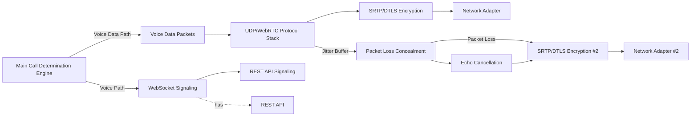
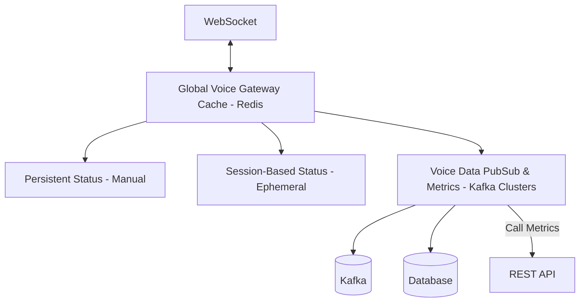
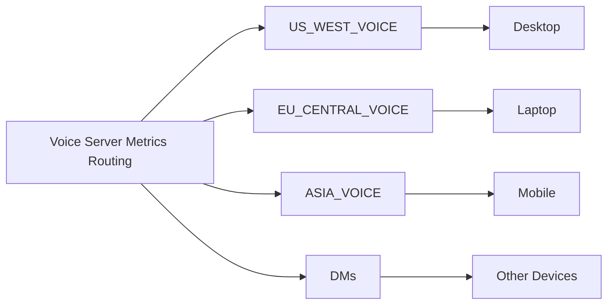
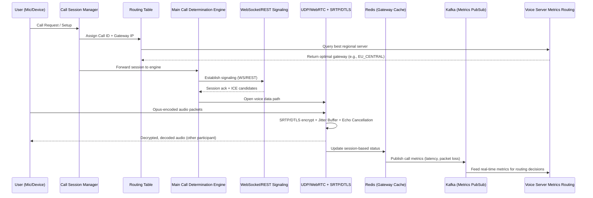

# Discord Real-Time Voice Call & Connection Logic

**Full Color Schematic — Reverse-Engineered Architecture Reference**

> This document is a conceptual, reverse-engineered breakdown of Discord's real-time voice call system — from call session management down to voice packet encryption and distributed metrics routing. It is split into three levels: **Top (Call Routing)**, **Middle (Voice Processing & Connection)**, and **Bottom (Distributed Infrastructure & Monitoring)**.


---

## Table of Contents

1. [Overview](#overview)
2. [Level 1 — Call Session & Routing Management](#level-1--call-session--routing-management)
3. [Level 2 — Real-Time Voice Processing & Connection](#level-2--real-time-voice-processing--connection)
4. [Level 3 — Distributed Infrastructure & Monitoring](#level-3--distributed-infrastructure--monitoring)
5. [End-to-End Call Flow (Mermaid)](#end-to-end-call-flow)
6. [Legend & Key Technologies](#legend--key-technologies)
7. [Glossary](#glossary)
8. [Credits](#credits)

---

## Overview

Discord's voice stack operates across three logical layers:

| Level | Responsibility | Core Components |
|---|---|---|
| **1 — Top** | Accept/route call requests, assign gateways | Call Session Manager, Routing Table |
| **2 — Middle** | Actual audio capture, encode, transmit, decrypt | Audio Pipeline, WebSocket Signaling, UDP/WebRTC, SRTP/DTLS |
| **3 — Bottom** | Presence state, caching, pub/sub metrics, server selection | Redis, Kafka, Voice Server Metrics Routing |

Data flows top to bottom: a call request originates at the **Call Session Manager**, the **Main Call Determination Engine** decides whether signaling goes over REST API or WebSocket, audio is encrypted and transmitted over the **UDP/WebRTC stack**, and in the background **Redis + Kafka** maintain the entire session state and metrics pipeline.

---

## Level 1 — Call Session & Routing Management

### What happens at this level

- **Call Request / Setup**: Incoming and outgoing call requests pass through a queue-like pipeline (the icons in the schematic represent the exchange of message bubbles — request, acknowledgment, setup confirmation).
- **Call Session Manager**: The central orchestrator. It determines which call is active, who the caller is, who the callee is, and manages the session lifecycle (start → active → end). The phone, call, and person icons represent this role.
- The manager handles both directions — **INCOMING** (creating a new call session) and **OUTGOING** (routing the session into the gateway table).

### Call Routing & Gateway Table

This table shows how, once a session is created, the call gets routed to a specific physical server gateway:

| CALL ID | CALLER ID | CALLEE ID | SERVER GATEWAY IP | CODEC | BITRATE | ENCRYPTION (DTLS/SRTP) |
|---|---|---|---|---|---|---|
| ... | ... | ... | e.g., US-West, EU-Central | Opus | 200 | ... |
| ... | ... | ... | e.g., US-West, EU-Central | Opus | 200 | ... |
| ... | ... | ... | ... | Opus | 200 | ... |

**Column-by-column explanation:**
- `CALL ID` — Unique session identifier.
- `CALLER ID` / `CALLEE ID` — User IDs of both participants.
- `SERVER GATEWAY IP` — The nearest geographic voice region (US-West, EU-Central, etc.) — chosen to minimize latency.
- `CODEC` — Discord uses the **Opus** codec (low-latency, high-quality voice compression).
- `BITRATE` — Default ~200 (kbps range, a quality vs. bandwidth tradeoff).
- `ENCRYPTION` — Every packet is secured via **DTLS/SRTP** (detailed in Level 2 below).

---

## Level 2 — Real-Time Voice Processing & Connection

This is the most complex layer — where actual audio data is captured, encoded, and transmitted across the network.

### Voice Input & Output Processing

```
🎤 Mic        → Input Audio Capture  → Opus Encoding   →┐
👤 User Input → (raw PCM audio)      → (compressed)    →├→ Main Call Determination Engine
🔊 Speaker    ← Audio Mixing         ← Output Playback ←┘
🎧 Headset    ← (combines streams)   ← (decoded audio)
```

- **Input Audio Capture**: Raw audio is captured from the microphone.
- **Opus Encoding**: Raw audio is compressed using the Opus codec — optimized for low bandwidth, high quality, and real-time performance.
- **Audio Mixing**: Streams from multiple participants are mixed into a single output.
- **Output Playback**: The mixed audio is decoded and played back through the speaker/headset.

### Main Call Determination Engine

This is the **centerpiece** of the entire Level 2 layer. It decides:
1. Whether voice data takes the **Voice Data Packets** path (a direct UDP/WebRTC stream).
2. Or whether it goes through signaling via **WebSocket** or **REST API**.

Its role is similar to a traffic cop — switching between the voice path and the signaling path based on connection state, packet loss conditions, or the call setup phase.

### Voice Protocol Stack (UDP/WebRTC)



**Component breakdown:**

| Component | Function |
|---|---|
| **Voice Data Packets** | Raw encoded audio to be sent over the network |
| **UDP/WebRTC Protocol Stack** | Low-latency transport layer — not TCP, since retransmission delay is not acceptable for real-time voice |
| **SRTP/DTLS Encryption** | Secure Real-time Transport Protocol over DTLS — encrypts voice packets end-to-end |
| **Jitter Buffer** | Smooths out network jitter (variation in packet arrival time) |
| **Packet Loss Concealment** | If a packet is dropped, the missing audio is interpolated/estimated so the call doesn't have an audible gap |
| **Echo Cancellation** | Removes audio that loops back from speaker to mic (echo) |
| **Network Adapter** | The physical/virtual NIC through which packets actually leave on the network |

**Signaling side** (parallel path):
- **WebSocket (Signaling)** — Real-time control messages (mute, join, leave, ICE candidate exchange).
- **REST API (Signaling)** — Stateless setup calls (token refresh, session metadata).

### Why two separate paths (voice vs. signaling)?

Voice data needs the **lowest possible latency** — hence UDP/WebRTC. Signaling (control messages) needs **reliability**, and packet loss is not acceptable there — hence WebSocket/REST. This separation lets Discord provide both guarantees simultaneously.

---

## Level 3 — Distributed Infrastructure & Monitoring

This is the backend layer that makes the entire system scalable and stateful.

### Presence Decision Table

How a user's "status" (Online/Idle/DND/Offline) is determined:

| Manual Status | WS Connected? | Device Active Pulse? | Idle Timer | Result Status |
|---|---|---|---|---|
| — | ✓ | ✓ | 0 | 🟢 ONLINE |
| DnD | ? | — | 0 | 🟡 IDLE |
| DnD | — | ✓ | 0 | 🔴 DND |
| Mlive | — | ✗ | — | ⚪ OFFLINE |

**Logic explained:**
- If the WebSocket is connected and the device shows an active pulse → **Online**.
- If DND is manually set and the WS state is uncertain → falls back to **Idle**.
- If DND is manually set with an active pulse but the WS is disconnected → **DND** persists.
- If a manual override ("Mlive" — manually live/offline flag) is set and there's no active pulse → **Offline**.

> This table shows that presence is a **priority-based decision tree**, not a simple boolean flag.

### Global Voice Gateway Cache (Redis)



- **Persistent Status (Manual)** — A status the user explicitly sets (e.g., manually setting "Invisible").
- **Session-Based Status (Ephemeral)** — Temporary, valid only for the duration of the current session (e.g., "Busy" during an active call).
- Redis caches both of these to enable **low-latency reads** (so a database query isn't needed for every presence check).

### Voice Data PubSub & Metrics (Kafka)

- **Call Metrics** (Latency, Packet Loss, etc.) are published from Redis into Kafka clusters.
- Kafka delivers these metrics to downstream consumers (dashboards, alerting, auto-scaling logic) via a **REST API**.
- This decoupled pub/sub model lets Discord track metrics for **millions of concurrent voice sessions** in real time without blocking the main call path.

### Real-Time Metrics Routing — Voice Server Selection



This component looks at live metrics (latency, load, packet loss) to decide which **regional voice server** to assign a user to — US West, EU Central, or Asia. The goal: lowest latency + best available capacity.

---

## End-to-End Call Flow

How the entire system interacts together:



---

## Legend & Key Technologies

| Icon | Technology | Role |
|---|---|---|
| 🟢 | **Opus Codec** | Voice compression — low latency, adaptive bitrate |
| 📄 | **UDP** | Transport protocol for real-time voice data |
| 🌐 | **WebRTC** | Peer-to-peer real-time communication framework |
| 🔒 | **SRTP/DTLS** | Encryption layer securing voice packets |
| 🔗 | **KAFKA** | Distributed pub/sub for call metrics streaming |
| 🟥 | **REDIS** | In-memory cache for gateway/session/presence state |

---

## Glossary

- **DTLS** — Datagram Transport Layer Security; the UDP-friendly version of TLS, used for encryption key exchange.
- **SRTP** — Secure Real-time Transport Protocol; carries the actual encrypted voice packets.
- **Jitter Buffer** — A buffer that absorbs network delay variation to deliver smooth playback.
- **Packet Loss Concealment (PLC)** — Technique for estimating/interpolating lost audio packets.
- **Opus** — An open, royalty-free audio codec optimized for both voice and music, with low latency.
- **Ephemeral Status** — Temporary state that expires as soon as the session ends.
- **Gateway IP** — The IP address of the regional voice server where actual media is routed.

---

## Credits

Schematic design & breakdown by:
- Instagram: [@iam92l](https://instagram.com/iam92l)
- Discord: `@92lr`

> Disclaimer: This is a **conceptual / educational reverse-engineering diagram** based on publicly known WebRTC, SRTP/DTLS, Kafka, and Redis architecture patterns. It is not Discord's official or leaked internal architecture.
